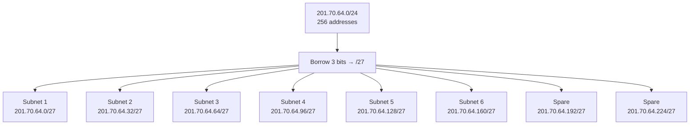
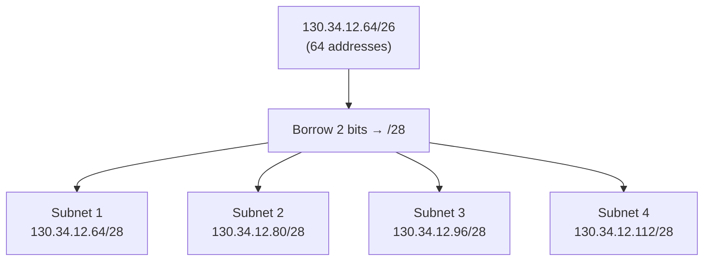
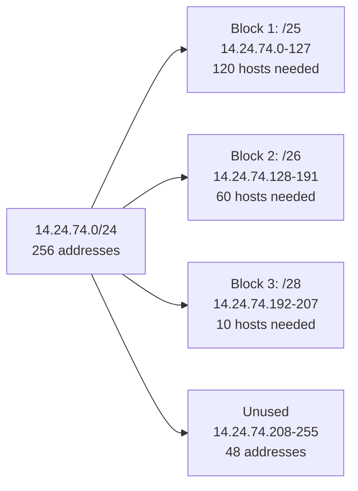
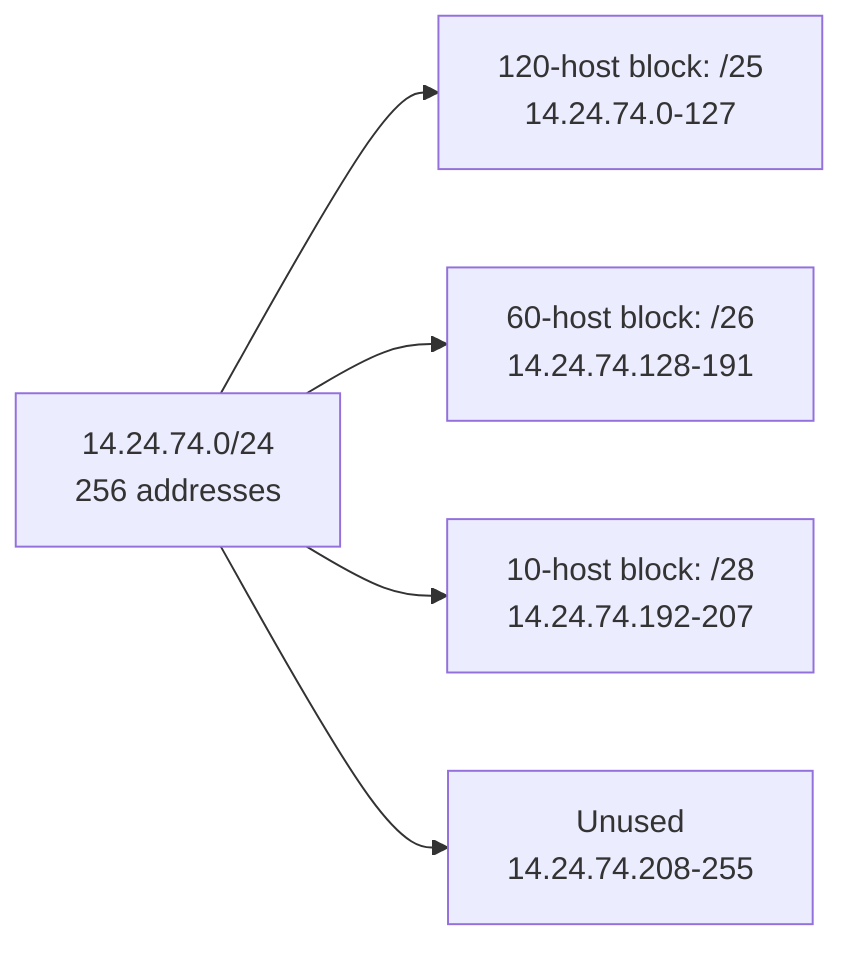
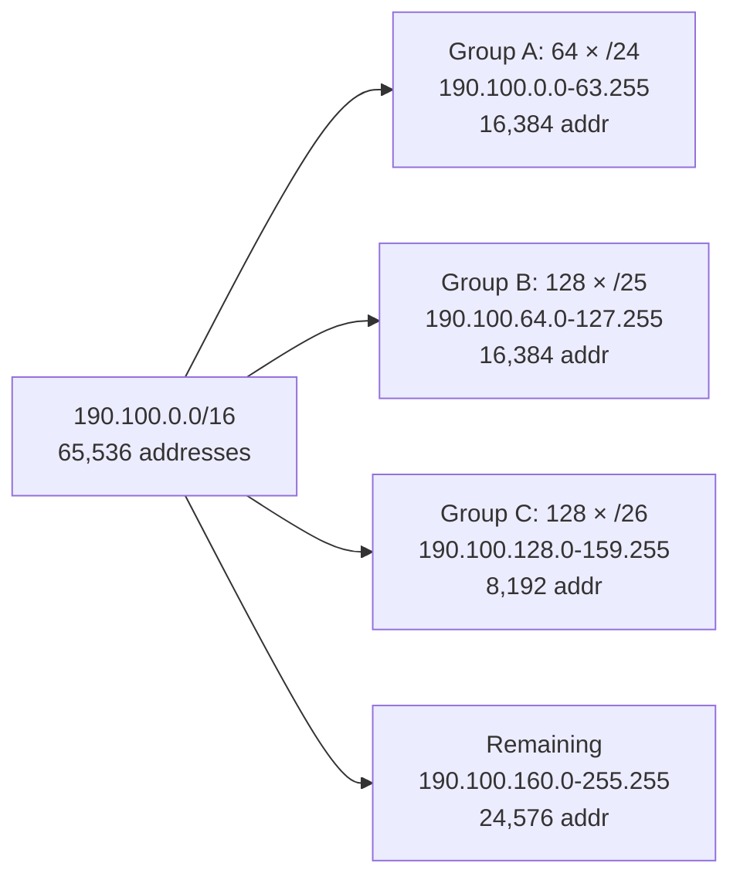
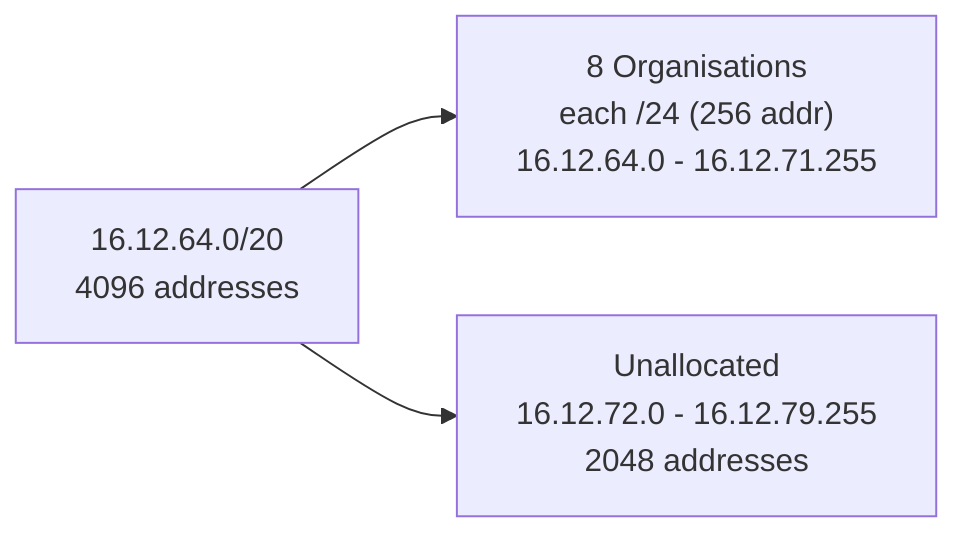
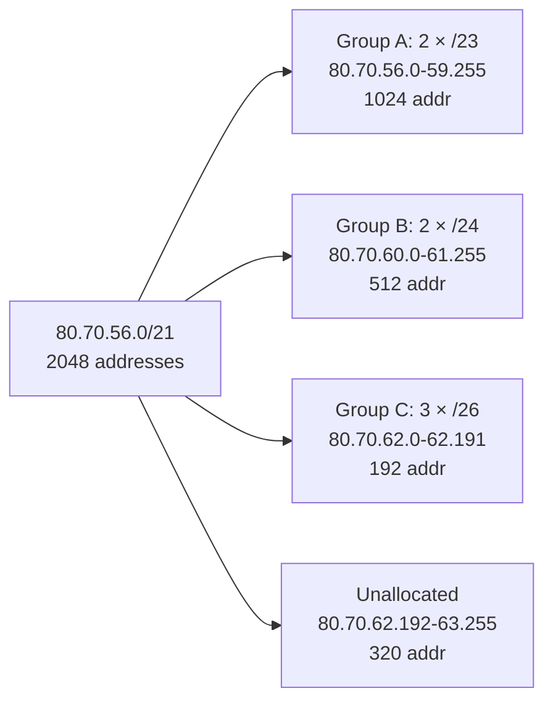
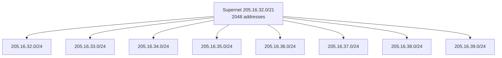
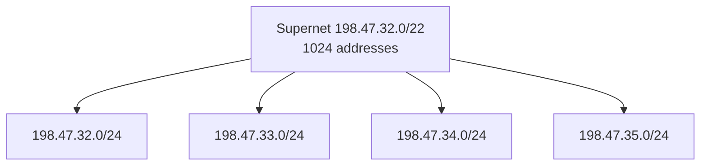
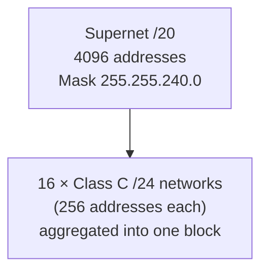

## Question 1

**Find the network address of the host with IP address 168.14.32.12, assuming the default classful mask.**

### Given

```text
IP Address = 168.14.32.12
```

### Step 1: Identify the Class

The first octet is **168**.

Class ranges (first octet):

| Class | Range   |
| ----- | ------- |
| A     | 0–127   |
| B     | 128–191 |
| C     | 192–223 |

Since `128 ≤ 168 ≤ 191`, this is a **Class B** address.

### Step 2: Default Classful Mask

Class B default mask:

```text
255.255.0.0  →  /16
```

This means the **first two octets** identify the network, and the **last two octets** identify the host.

### Step 3: Apply the Mask (Binary AND)

```text
IP:    10101000.00001110.00100000.00001100   (168.14.32.12)
Mask:  11111111.11111111.00000000.00000000   (255.255.0.0)
-----------------------------------------------
AND:   10101000.00001110.00000000.00000000   (168.14.0.0)
```

### Final Answer

| Term            | Value       |
| ---------------- | ----------- |
| Class            | B           |
| Default Mask      | 255.255.0.0 (/16) |
| **Network Address** | **168.14.0.0** |

---

## Question 2

**Find the subnetwork address for IP Address = 200.45.34.56, Subnet Mask = 255.255.240.0, using the straight binary method.**

### Given

```text
IP Address  = 200.45.34.56
Subnet Mask = 255.255.240.0
```

### Step 1: Convert Both to Binary

```text
IP:    11001000.00101101.00100010.00111000
Mask:  11111111.11111111.11110000.00000000
```

### Step 2: Perform the Bitwise AND

```text
   11001000.00101101.00100010.00111000
 & 11111111.11111111.11110000.00000000
 -------------------------------------
   11001000.00101101.00100000.00000000
```

### Step 3: Convert the Result Back to Decimal

```text
11001000 = 200
00101101 = 45
00100000 = 32
00000000 = 0
```

### Final Answer

| Term                  | Value          |
| ---------------------- | -------------- |
| Prefix Length           | /20            |
| **Subnetwork Address**  | **200.45.32.0** |

---

## Question 3

**Find the subnetwork address for IP Address = 19.30.84.5, Subnet Mask = 255.255.192.0, using the shortcut method.**

### Given

```text
IP Address  = 19.30.84.5
Subnet Mask = 255.255.192.0
```

### Step 1: Convert Mask to Prefix

```text
255.255.192.0 → 11111111.11111111.11000000.00000000
8 + 8 + 2 = 18 bits
```

```text
Prefix = /18
```

### Step 2: Identify the Interesting Octet

The mask stops being all-1s in the **third octet** (value 192), so the third octet is where the calculation happens. The first two octets (19.30) simply carry over unchanged.

### Step 3: Find the Block Size

```text
Block Size = 256 - Mask Value (interesting octet)
Block Size = 256 - 192 = 64
```

### Step 4: Find the Subnet Range Containing the Third Octet

Third octet of the IP = **84**

Multiples of 64:

```text
0 – 63
64 – 127   ← 84 falls here
128 – 191
192 – 255
```

So the subnet starts at **64**.

### Step 5: Assemble the Subnetwork Address

```text
First two octets unchanged: 19.30
Third octet: 64
Fourth octet: always 0
```

### Final Answer

| Term                  | Value        |
| ---------------------- | ------------ |
| Prefix Length           | /18          |
| Block Size              | 64           |
| **Subnetwork Address**  | **19.30.64.0** |

---

## Question 4

**A router receives a packet with destination address 190.240.224.33. Find the subnetwork address if the subnet mask is /19.**

### Given

```text
Destination Address = 190.240.224.33
Prefix               = /19
```

### Step 1: Convert Prefix to Mask

```text
/19 = 11111111.11111111.11100000.00000000
    = 255.255.224.0
```

### Step 2: Identify the Interesting Octet

The mask breaks in the **third octet** (value 224).

### Step 3: Find the Block Size

```text
Block Size = 256 - 224 = 32
```

### Step 4: Find the Subnet Range Containing the Third Octet

Third octet of IP = **224**

Multiples of 32:

```text
0, 32, 64, 96, 128, 160, 192, 224
```

224 is itself an exact multiple of 32, so 224 is the **start** of its own block:

```text
224 – 255
```

### Step 5: Assemble the Subnetwork Address

```text
First two octets unchanged: 190.240
Third octet: 224
Fourth octet: 0
```

### Binary Verification

```text
IP:    10111110.11110000.11100000.00100001
Mask:  11111111.11111111.11100000.00000000
-------------------------------------------
AND:   10111110.11110000.11100000.00000000  = 190.240.224.0
```

### Final Answer

| Term                  | Value            |
| ---------------------- | ---------------- |
| Block Size              | 32                |
| **Subnetwork Address**  | **190.240.224.0** |

---

## Question 5

**A router receives a packet with destination address 190.240.33.91. Show how the router finds the network address and the subnetwork address, assuming the subnet mask is /19.**

### Given

```text
Destination Address = 190.240.33.91
Prefix (subnet)      = /19
```

There are **two** things being asked here, and they use two different masks:

* **Network address** → uses the **default classful mask** for the address's class.
* **Subnetwork address** → uses the **given /19 mask**.

### Part A: Network Address (Classful)

**Step 1 — Identify the Class**

First octet = 190 → falls in 128–191 → **Class B**

**Step 2 — Default Mask**

```text
Class B default mask = 255.255.0.0  (/16)
```

**Step 3 — Apply AND**

```text
IP:   10111110.11110000.00100001.01011011
Mask: 11111111.11111111.00000000.00000000
-------------------------------------------
AND:  10111110.11110000.00000000.00000000 = 190.240.0.0
```

**Network Address = 190.240.0.0**

### Part B: Subnetwork Address (/19)

**Step 1 — Convert Mask**

```text
/19 = 255.255.224.0
```

**Step 2 — Block Size (third octet)**

```text
Block Size = 256 - 224 = 32
```

**Step 3 — Locate the Block**

Third octet of IP = **33**

```text
0 – 31
32 – 63   ← 33 falls here
```

Subnet starts at **32**.

**Step 4 — Assemble**

```text
190.240.32.0
```

**Binary Verification**

```text
IP:   10111110.11110000.00100001.01011011
Mask: 11111111.11111111.11100000.00000000
-------------------------------------------
AND:  10111110.11110000.00100000.00000000 = 190.240.32.0
```

### Final Answer

| Term                   | Value           |
| ----------------------- | --------------- |
| Network Address (classful) | **190.240.0.0**  |
| Subnetwork Address (/19)   | **190.240.32.0** |

---

## Question 6

**A company is granted the Class C address 201.70.64.0. The company requires 6 subnets. Design the subnet mask and determine borrowed bits, number of subnets, hosts per subnet, network addresses, broadcast addresses, and valid host ranges.**

### Given

```text
Network = 201.70.64.0/24  (Class C, default 8 host bits)
Subnets needed = 6
```

### Step 1: Determine Borrowed Bits

We need `2^n ≥ 6` subnets.

```text
2^1 = 2   (not enough)
2^2 = 4   (not enough)
2^3 = 8   (enough) ✔
```

**Borrowed bits (n) = 3**

### Step 2: New Prefix and Mask

```text
New prefix = /24 + 3 = /27
New mask   = 255.255.255.224
```

Binary of the last octet:

```text
11100000  = 224
```

### Step 3: Number of Subnets Created

```text
2^3 = 8 subnets
```

(6 are required; 8 are available — 2 remain spare for growth.)

### Step 4: Hosts per Subnet

```text
Host bits = 32 - 27 = 5
Total addresses per subnet = 2^5 = 32
Usable hosts = 32 - 2 = 30   (subtract network + broadcast)
```

### Step 5: Block Size

```text
Block Size = 256 - 224 = 32
```

### Step 6: List All Subnets

| Subnet # | Network Address | Broadcast Address | Usable Host Range              |
| :------: | ---------------- | ------------------ | ------------------------------- |
| 1        | 201.70.64.0       | 201.70.64.31        | 201.70.64.1 – 201.70.64.30       |
| 2        | 201.70.64.32      | 201.70.64.63        | 201.70.64.33 – 201.70.64.62      |
| 3        | 201.70.64.64      | 201.70.64.95        | 201.70.64.65 – 201.70.64.94      |
| 4        | 201.70.64.96      | 201.70.64.127       | 201.70.64.97 – 201.70.64.126     |
| 5        | 201.70.64.128     | 201.70.64.159       | 201.70.64.129 – 201.70.64.158    |
| 6        | 201.70.64.160     | 201.70.64.191       | 201.70.64.161 – 201.70.64.190    |
| 7*       | 201.70.64.192     | 201.70.64.223       | 201.70.64.193 – 201.70.64.222    |
| 8*       | 201.70.64.224     | 201.70.64.255       | 201.70.64.225 – 201.70.64.254    |

`*` Subnets 7 and 8 are spare capacity (only 6 were requested).

### Subnet Hierarchy Diagram



### Final Answer Summary

| Term              | Value              |
| ------------------ | ------------------ |
| Borrowed Bits        | 3                   |
| New Mask             | 255.255.255.224 (/27) |
| Number of Subnets    | 8                   |
| Hosts per Subnet     | 32 total / 30 usable |

---

## Question 7

**A company is granted the Class B address 181.56.0.0. The company requires 1000 subnets. Determine borrowed bits, new subnet mask, prefix length, number of subnets, and hosts per subnet.**

### Given

```text
Network = 181.56.0.0/16  (Class B, default 16 host bits)
Subnets needed = 1000
```

### Step 1: Determine Borrowed Bits

We need `2^n ≥ 1000`.

```text
2^9  = 512    (not enough)
2^10 = 1024   (enough) ✔
```

**Borrowed bits (n) = 10**

### Step 2: New Prefix and Mask

```text
New prefix = /16 + 10 = /26
```

Binary of the mask's third and fourth octets:

```text
Third octet:  11111111 = 255
Fourth octet: 11000000 = 192
```

```text
New Mask = 255.255.255.192
```

### Step 3: Number of Subnets Created

```text
2^10 = 1024 subnets
```

### Step 4: Hosts per Subnet

```text
Host bits = 32 - 26 = 6
Total addresses per subnet = 2^6 = 64
Usable hosts = 64 - 2 = 62
```

### Final Answer

| Term              | Value              |
| ------------------ | ------------------ |
| Borrowed Bits        | 10                  |
| New Subnet Mask      | 255.255.255.192      |
| Prefix Length         | /26                 |
| Number of Subnets    | 1024                |
| Hosts per Subnet     | 64 total / 62 usable |

---

## Question 8

**An organisation is granted the block 130.56.0.0/16. The administrator requires 1024 subnets. Find the number of addresses in each subnet, the subnet prefix, and the first/last address of the first and last subnets.**

### Given

```text
Network = 130.56.0.0/16
Subnets needed = 1024
```

### Step 1: Borrowed Bits

```text
2^10 = 1024 subnets exactly ✔
```

Borrowed bits = 10

### Step 2: New Prefix

```text
New prefix = /16 + 10 = /26
```

### Step 3: Addresses per Subnet

```text
Host bits = 32 - 26 = 6
Addresses per subnet = 2^6 = 64
```

### Step 4: Subnet Prefix / Mask

```text
/26 = 255.255.255.192
```

### Step 5: First Subnet

The host portion originally spanned the third and fourth octets (16 bits, values 0–65535). Borrowing 10 bits divides this 16‑bit space into 1024 blocks of 64.

```text
First subnet block = index 0 → offset 0 in the 16-bit space
```

```text
First Address = 130.56.0.0
Last Address  = 130.56.0.63
```

### Step 6: Last Subnet (index 1024, i.e. block #1024)

```text
Offset of last block = (1024 - 1) × 64 = 65472
```

Convert offset 65472 into (third octet, fourth octet):

```text
65472 ÷ 256 = 255 remainder 192
```

```text
Third octet = 255
Fourth octet (start) = 192
```

```text
First Address of last subnet = 130.56.255.192
Last Address of last subnet  = 130.56.255.192 + 63 = 130.56.255.255
```

### Final Answer

| Term                          | Value              |
| ------------------------------ | ------------------ |
| Addresses per Subnet             | 64                  |
| Subnet Prefix                    | /26 (255.255.255.192) |
| First Address of First Subnet     | 130.56.0.0          |
| Last Address of First Subnet      | 130.56.0.63         |
| First Address of Last Subnet      | 130.56.255.192      |
| Last Address of Last Subnet       | 130.56.255.255      |

---

## Question 9

**A small organisation is given the block 205.16.37.24/29. Find the first address, last address, and number of addresses in the block using both the binary method and the shortcut method.**

### Given

```text
Address = 205.16.37.24/29
```

### Method 1: Binary Method

**Step 1 — Convert to Binary**

```text
205.16.37.24 = 11001101.00010000.00100101.00011000
```

**Step 2 — Mask for /29**

```text
/29 = 11111111.11111111.11111111.11111000  = 255.255.255.248
```

**Step 3 — AND to Find First Address**

```text
   11001101.00010000.00100101.00011000
 & 11111111.11111111.11111111.11111000
 -------------------------------------
   11001101.00010000.00100101.00011000  = 205.16.37.24
```

**Step 4 — OR with Inverse Mask to Find Last Address**

```text
Inverse mask = 00000000.00000000.00000000.00000111

   11001101.00010000.00100101.00011000
 | 00000000.00000000.00000000.00000111
 -------------------------------------
   11001101.00010000.00100101.00011111  = 205.16.37.31
```

### Method 2: Shortcut Method

**Step 1 — Block Size**

```text
/29 → 3 host bits → Block Size = 2^3 = 8
```

Or equivalently: `256 - 248 = 8`

**Step 2 — Locate the Block**

Fourth octet = 24. Multiples of 8: `0, 8, 16, 24, 32...`
24 is itself a multiple of 8, so 24 is the **start** of the block:

```text
24 – 31
```

**Step 3 — First and Last Address**

```text
First Address = 205.16.37.24
Last Address  = 205.16.37.31
```

### Final Answer

| Term              | Value           |
| ------------------ | ---------------- |
| First Address        | 205.16.37.24     |
| Last Address         | 205.16.37.31     |
| Total Addresses      | 2³ = 8           |

Both methods agree.

---

## Question 10

**One address in a block is 167.199.170.82/27. Find the network address.**

### Given

```text
Address = 167.199.170.82/27
```

### Step 1: Convert Mask

```text
/27 = 255.255.255.224
```

### Step 2: Block Size

```text
Block Size = 256 - 224 = 32
```

### Step 3: Locate the Block

Fourth octet = 82. Multiples of 32:

```text
0, 32, 64, 96, 128...
64 – 95   ← 82 falls here
```

### Step 4: Network Address

```text
167.199.170.64
```

### Binary Verification

```text
IP:   10100111.11000111.10101010.01010010
Mask: 11111111.11111111.11111111.11100000
-------------------------------------------
AND:  10100111.11000111.10101010.01000000 = 167.199.170.64
```

### Final Answer

| Term              | Value              |
| ------------------ | ------------------- |
| **Network Address** | **167.199.170.64**   |

---

## Question 11

**One address in a block is 205.16.37.39/28. Find the first address, last address, total addresses, and usable host range using the binary method and the mask method.**

### Given

```text
Address = 205.16.37.39/28
```

### Method 1: Binary Method

```text
IP:    11001101.00010000.00100101.00100111  (205.16.37.39)
Mask:  11111111.11111111.11111111.11110000  (/28 = 255.255.255.240)
-------------------------------------------
AND:   11001101.00010000.00100101.00100000  = 205.16.37.32   (network/first address)
```

Last address = network OR inverse mask:

```text
Inverse mask = 00000000.00000000.00000000.00001111

   11001101.00010000.00100101.00100000
 | 00000000.00000000.00000000.00001111
 -------------------------------------
   11001101.00010000.00100101.00101111  = 205.16.37.47
```

### Method 2: Mask (Shortcut) Method

```text
Block Size = 256 - 240 = 16
```

Fourth octet = 39. Multiples of 16: `0, 16, 32, 48...`

```text
32 – 47   ← 39 falls here
```

```text
First Address = 205.16.37.32
Last Address  = 205.16.37.47
```

Both methods match.

### Total Addresses and Usable Range

```text
Host bits = 32 - 28 = 4
Total Addresses = 2^4 = 16
Usable Hosts = 16 - 2 = 14
```

### Final Answer

| Term              | Value                          |
| ------------------ | -------------------------------- |
| First Address        | 205.16.37.32                     |
| Last Address         | 205.16.37.47                     |
| Total Addresses      | 16                                |
| Usable Host Range    | 205.16.37.33 – 205.16.37.46      |

---

## Question 12

**Each address belongs to a block. Find the first address, last address, and usable host range.**

### (a) 14.12.72.8/24

**Step 1 — Block Size**

`/24` means the entire fourth octet is host space → block size = 256 (whole octet), i.e., the network is fixed at the third octet.

**Step 2 — Network Address**

Since the mask covers exactly the first three octets, the third octet (72) does not change; only the fourth octet resets to 0.

```text
First Address = 14.12.72.0
Last Address  = 14.12.72.255
```

**Step 3 — Usable Host Range**

```text
14.12.72.1 – 14.12.72.254
```

| Term         | Value              |
| ------------- | ------------------- |
| First Address   | 14.12.72.0            |
| Last Address    | 14.12.72.255          |
| Usable Range    | 14.12.72.1 – 14.12.72.254 |

---

### (b) 200.107.16.17/18

**Step 1 — Mask**

```text
/18 = 255.255.192.0
```

**Step 2 — Block Size (third octet)**

```text
Block Size = 256 - 192 = 64
```

**Step 3 — Locate the Block**

Third octet = 16. Multiples of 64: `0, 64, 128, 192`

```text
0 – 63   ← 16 falls here
```

**Step 4 — Addresses**

```text
First Address = 200.107.0.0
Last Address  = 200.107.63.255
```

**Step 5 — Usable Host Range**

```text
200.107.0.1 – 200.107.63.254
```

| Term         | Value                     |
| ------------- | -------------------------- |
| First Address   | 200.107.0.0                 |
| Last Address    | 200.107.63.255              |
| Usable Range    | 200.107.0.1 – 200.107.63.254 |

---

### (c) 70.110.19.17/16

**Step 1 — Mask**

```text
/16 = 255.255.0.0
```

**Step 2 — Network Address**

The first two octets (70.110) are fixed; the last two reset to 0.

```text
First Address = 70.110.0.0
Last Address  = 70.110.255.255
```

**Step 3 — Usable Host Range**

```text
70.110.0.1 – 70.110.255.254
```

| Term         | Value                       |
| ------------- | ---------------------------- |
| First Address   | 70.110.0.0                    |
| Last Address    | 70.110.255.255                |
| Usable Range    | 70.110.0.1 – 70.110.255.254   |

---

## Question 13

**An organisation is granted the block 130.34.12.64/26. The organisation requires 4 subnets. Design the subnets and show the address range of each.**

### Given

```text
Block = 130.34.12.64/26
Subnets needed = 4
```

### Step 1: Verify the Base Block

```text
/26 → host bits = 32 - 26 = 6 → block size = 2^6 = 64
```

Since the fourth octet = 64, and 64 is a multiple of 64, the given block spans:

```text
130.34.12.64  –  130.34.12.127
```

### Step 2: Borrowed Bits for 4 Subnets

```text
2^2 = 4  ✔
```

Borrowed bits = 2

### Step 3: New Prefix

```text
New prefix = /26 + 2 = /28
New mask   = 255.255.255.240
```

### Step 4: New Block Size

```text
Block Size = 256 - 240 = 16
```

### Step 5: Divide the Range 64–127 into 4 Blocks of 16

| Subnet | Network Address    | Broadcast Address   | Usable Host Range                  |
| :----: | -------------------- | --------------------- | ------------------------------------ |
| 1      | 130.34.12.64/28        | 130.34.12.79            | 130.34.12.65 – 130.34.12.78          |
| 2      | 130.34.12.80/28        | 130.34.12.95            | 130.34.12.81 – 130.34.12.94          |
| 3      | 130.34.12.96/28        | 130.34.12.111           | 130.34.12.97 – 130.34.12.110         |
| 4      | 130.34.12.112/28       | 130.34.12.127           | 130.34.12.113 – 130.34.12.126        |

### Diagram



---

## Question 14

**An organisation is granted the block 14.24.74.0/24. It needs three sub-blocks: one of 120, one of 60, and one of 10 addresses. Design the VLSM allocation.**

### Given

```text
Block = 14.24.74.0/24   (256 addresses total)
Sub-blocks required: 120, 60, 10 addresses
```

### VLSM Principle

Always allocate the **largest** requirement first, using the smallest power-of-two block that is **≥** the requirement, then continue allocating from where the previous block ended.

### Step 1: Sort Requirements (Descending)

```text
120  →  60  →  10
```

### Step 2: Sub-block 1 — 120 Addresses

```text
Smallest power of 2 ≥ 120 = 128 = 2^7
Host bits = 7  →  Prefix = 32 - 7 = /25
```

```text
Range: 14.24.74.0 – 14.24.74.127   (128 addresses)
```

```text
Sub-block 1 = 14.24.74.0/25
```

### Step 3: Sub-block 2 — 60 Addresses

```text
Smallest power of 2 ≥ 60 = 64 = 2^6
Host bits = 6  →  Prefix = 32 - 6 = /26
```

Starts immediately after block 1 ends (127), i.e., at **128**:

```text
Range: 14.24.74.128 – 14.24.74.191   (64 addresses)
```

```text
Sub-block 2 = 14.24.74.128/26
```

### Step 4: Sub-block 3 — 10 Addresses

```text
Smallest power of 2 ≥ 10 = 16 = 2^4
Host bits = 4  →  Prefix = 32 - 4 = /28
```

Starts after block 2 ends (191), i.e., at **192**:

```text
Range: 14.24.74.192 – 14.24.74.207   (16 addresses)
```

```text
Sub-block 3 = 14.24.74.192/28
```

### Step 5: Remaining Address Space

```text
Used: 128 + 64 + 16 = 208 addresses
Remaining: 256 - 208 = 48 addresses
Range: 14.24.74.208 – 14.24.74.255
```

### VLSM Allocation Diagram



### Final Allocation Table

| Sub-block | Hosts Needed | Prefix | Network Address | Range                         |
| :-------: | :-----------: | :----: | ------------------ | ------------------------------ |
| 1         | 120            | /25    | 14.24.74.0            | 14.24.74.0 – 14.24.74.127        |
| 2         | 60             | /26    | 14.24.74.128          | 14.24.74.128 – 14.24.74.191      |
| 3         | 10             | /28    | 14.24.74.192          | 14.24.74.192 – 14.24.74.207      |
| Unused    | —              | —      | 14.24.74.208          | 14.24.74.208 – 14.24.74.255      |

---

## Question 15

**An organisation is granted the block 14.24.74.0/24. It needs three sub-blocks: one of 10, one of 60, and one of 120 addresses. Design the VLSM allocation.**

### Given

```text
Block = 14.24.74.0/24   (256 addresses total)
Sub-blocks required (as listed): 10, 60, 120 addresses
```

### Important VLSM Rule

The **order in which requirements are listed in the question does not determine the allocation order**. VLSM always allocates from **largest to smallest**, regardless of the order the sizes are mentioned in, because larger blocks require stricter address alignment and must be placed first to avoid fragmentation and wasted space.

So even though this question lists 10 first, we still sort descending:

```text
120  →  60  →  10
```

This makes Question 15 mathematically **identical** to Question 14 — only the wording order differs.

### Step 1: Sub-block for 120 Addresses

```text
2^7 = 128 ≥ 120  →  Prefix = /25
Range: 14.24.74.0 – 14.24.74.127
```

### Step 2: Sub-block for 60 Addresses

```text
2^6 = 64 ≥ 60  →  Prefix = /26
Range: 14.24.74.128 – 14.24.74.191
```

### Step 3: Sub-block for 10 Addresses

```text
2^4 = 16 ≥ 10  →  Prefix = /28
Range: 14.24.74.192 – 14.24.74.207
```

### Step 4: Remaining Space

```text
Used = 128 + 64 + 16 = 208
Remaining = 256 - 208 = 48
Range: 14.24.74.208 – 14.24.74.255
```

### VLSM Allocation Diagram



### Final Allocation Table

| Requested Size | Allocation Order | Prefix | Network Address | Range                        |
| :--------------: | :-----------------: | :----: | ------------------ | ------------------------------ |
| 120               | 1st (largest)          | /25    | 14.24.74.0            | 14.24.74.0 – 14.24.74.127        |
| 60                | 2nd                    | /26    | 14.24.74.128          | 14.24.74.128 – 14.24.74.191      |
| 10                | 3rd (smallest)         | /28    | 14.24.74.192          | 14.24.74.192 – 14.24.74.207      |

**Conclusion:** The final address allocation is identical to Question 14, because VLSM design depends on block sizes, not on the order they are requested in.

---

## Question 16

**An ISP is granted the block 190.100.0.0/16. It must serve 64 customers requiring 256 addresses each, 128 customers requiring 128 addresses each, and 128 customers requiring 64 addresses each. Determine the prefix used for each group, address ranges allocated, total addresses used, and remaining addresses available.**

### Given

```text
ISP Block = 190.100.0.0/16   (65,536 addresses total)

Group A: 64 customers × 256 addresses each
Group B: 128 customers × 128 addresses each
Group C: 128 customers × 64 addresses each
```

### Step 1: Prefix for Each Group

```text
Group A: 256 = 2^8   → host bits = 8 → prefix = /24
Group B: 128 = 2^7   → host bits = 7 → prefix = /25
Group C: 64  = 2^6   → host bits = 6 → prefix = /26
```

### Step 2: Total Address Demand per Group

```text
Group A: 64  × 256 = 16,384 addresses
Group B: 128 × 128 = 16,384 addresses
Group C: 128 × 64  = 8,192  addresses
```

### Step 3: Allocate in VLSM Order (Largest Block-Size First: A, then B, then C)

**Group A (16,384 addresses, /24 each):**

```text
16,384 addresses = 64 × 256  →  spans third octet 0–63
Range: 190.100.0.0 – 190.100.63.255
```

Example allocations: `190.100.0.0/24, 190.100.1.0/24, … 190.100.63.0/24` (64 subnets)

**Group B (16,384 addresses, /25 each), starting where Group A ended (third octet 64):**

```text
16,384 addresses = 64 × 256  →  spans third octet 64–127
Range: 190.100.64.0 – 190.100.127.255
```

Example allocations: `190.100.64.0/25, 190.100.64.128/25, 190.100.65.0/25, … 190.100.127.128/25` (128 subnets, 2 per third-octet value)

**Group C (8,192 addresses, /26 each), starting where Group B ended (third octet 128):**

```text
8,192 addresses = 32 × 256  →  spans third octet 128–159
Range: 190.100.128.0 – 190.100.159.255
```

Example allocations: `190.100.128.0/26, 190.100.128.64/26, 190.100.128.128/26, 190.100.128.192/26, 190.100.129.0/26, … 190.100.159.192/26` (128 subnets, 4 per third-octet value)

### Step 4: Total Used and Remaining

```text
Total Used = 16,384 + 16,384 + 8,192 = 40,960 addresses
Total Available (/16) = 65,536 addresses
Remaining = 65,536 - 40,960 = 24,576 addresses
Remaining Range: 190.100.160.0 – 190.100.255.255
```

### Allocation Diagram



### Final Answer Table

| Group | Customers | Addr/Customer | Prefix | Range                              | Total Addresses |
| :---: | :---------: | :--------------: | :----: | ------------------------------------ | :---------------: |
| A     | 64          | 256               | /24    | 190.100.0.0 – 190.100.63.255           | 16,384             |
| B     | 128         | 128               | /25    | 190.100.64.0 – 190.100.127.255         | 16,384             |
| C     | 128         | 64                | /26    | 190.100.128.0 – 190.100.159.255        | 8,192              |
| —     | —           | —                 | —      | 190.100.160.0 – 190.100.255.255 (unused) | 24,576             |

---

## Question 17

**An ISP is granted the block 16.12.64.0/20. It must allocate addresses to 8 organisations, each requiring 256 addresses. Find the number and range of addresses in the ISP block, the range allocated to each organisation, the unallocated range, and a distribution outline.**

### Given

```text
ISP Block = 16.12.64.0/20
Organisations = 8, each needing 256 addresses
```

### Step 1: Total Addresses in the ISP Block

```text
Host bits = 32 - 20 = 12
Total Addresses = 2^12 = 4096
```

### Step 2: Range of the ISP Block

```text
/20 → mask = 255.255.240.0 → block size (third octet) = 256 - 240 = 16
```

Third octet starts at 64, block size 16:

```text
64 + 16 - 1 = 79
```

```text
Range: 16.12.64.0 – 16.12.79.255
```

### Step 3: Prefix per Organisation

```text
256 = 2^8  →  host bits = 8  →  prefix = /24
```

### Step 4: Allocate 8 Organisations Sequentially

| Organisation | Network Address | Range                    |
| :-------------: | ------------------ | --------------------------- |
| Org 1            | 16.12.64.0/24         | 16.12.64.0 – 16.12.64.255      |
| Org 2            | 16.12.65.0/24         | 16.12.65.0 – 16.12.65.255      |
| Org 3            | 16.12.66.0/24         | 16.12.66.0 – 16.12.66.255      |
| Org 4            | 16.12.67.0/24         | 16.12.67.0 – 16.12.67.255      |
| Org 5            | 16.12.68.0/24         | 16.12.68.0 – 16.12.68.255      |
| Org 6            | 16.12.69.0/24         | 16.12.69.0 – 16.12.69.255      |
| Org 7            | 16.12.70.0/24         | 16.12.70.0 – 16.12.70.255      |
| Org 8            | 16.12.71.0/24         | 16.12.71.0 – 16.12.71.255      |

### Step 5: Total Used vs. Unallocated

```text
Used = 8 × 256 = 2048 addresses (16.12.64.0 – 16.12.71.255)
Total = 4096 addresses
Unallocated = 4096 - 2048 = 2048 addresses
Unallocated Range: 16.12.72.0 – 16.12.79.255
```

### Distribution Diagram



### Final Answer

| Term                  | Value                          |
| ---------------------- | --------------------------------- |
| ISP Block Range           | 16.12.64.0 – 16.12.79.255            |
| Total Addresses            | 4096                                |
| Prefix per Organisation    | /24                                 |
| Allocated Range             | 16.12.64.0 – 16.12.71.255            |
| Unallocated Range           | 16.12.72.0 – 16.12.79.255            |

---

## Question 18

**An ISP is granted the block 80.70.56.0/21. It must allocate addresses to two organisations requiring 500 addresses each, two requiring 250 each, and three requiring 50 each. Find the number and range of addresses in the ISP block, the address allocation for each organisation, the unallocated range, and a distribution outline.**

### Given

```text
ISP Block = 80.70.56.0/21

Group A: 2 organisations × 500 addresses
Group B: 2 organisations × 250 addresses
Group C: 3 organisations × 50 addresses
```

### Step 1: Total Addresses in the ISP Block

```text
Host bits = 32 - 21 = 11
Total Addresses = 2^11 = 2048
```

### Step 2: Range of the ISP Block

```text
/21 → mask = 255.255.248.0 → block size (third octet) = 256 - 248 = 8
```

Third octet starts at 56 (56 is an exact multiple of 8):

```text
56 + 8 - 1 = 63
```

```text
Range: 80.70.56.0 – 80.70.63.255
```

### Step 3: Prefix for Each Group

```text
Group A (500): smallest power of 2 ≥ 500 = 512 = 2^9  → prefix = /23
Group B (250): smallest power of 2 ≥ 250 = 256 = 2^8  → prefix = /24
Group C (50):  smallest power of 2 ≥ 50  = 64  = 2^6  → prefix = /26
```

### Step 4: VLSM Allocation (Largest First)

**Group A — 2 × /23 (512 addresses each), starting at 80.70.56.0:**

```text
Org A1: 80.70.56.0/23   → 80.70.56.0 – 80.70.57.255
Org A2: 80.70.58.0/23   → 80.70.58.0 – 80.70.59.255
```

**Group B — 2 × /24 (256 addresses each), starting at 80.70.60.0:**

```text
Org B1: 80.70.60.0/24   → 80.70.60.0 – 80.70.60.255
Org B2: 80.70.61.0/24   → 80.70.61.0 – 80.70.61.255
```

**Group C — 3 × /26 (64 addresses each), starting at 80.70.62.0:**

```text
Org C1: 80.70.62.0/26    → 80.70.62.0 – 80.70.62.63
Org C2: 80.70.62.64/26   → 80.70.62.64 – 80.70.62.127
Org C3: 80.70.62.128/26  → 80.70.62.128 – 80.70.62.191
```

### Step 5: Unallocated Range

```text
Used = (2×512) + (2×256) + (3×64) = 1024 + 512 + 192 = 1728
Total = 2048
Unallocated = 2048 - 1728 = 320 addresses
Range: 80.70.62.192 – 80.70.63.255
```

### Distribution Diagram



### Final Answer Table

| Organisation | Addresses Needed | Prefix | Range                     |
| :-------------: | :------------------: | :----: | ---------------------------- |
| A1               | 500                   | /23    | 80.70.56.0 – 80.70.57.255       |
| A2               | 500                   | /23    | 80.70.58.0 – 80.70.59.255       |
| B1               | 250                   | /24    | 80.70.60.0 – 80.70.60.255       |
| B2               | 250                   | /24    | 80.70.61.0 – 80.70.61.255       |
| C1               | 50                    | /26    | 80.70.62.0 – 80.70.62.63        |
| C2               | 50                    | /26    | 80.70.62.64 – 80.70.62.127      |
| C3               | 50                    | /26    | 80.70.62.128 – 80.70.62.191     |
| Unallocated      | —                     | —      | 80.70.62.192 – 80.70.63.255     |

---

## Question 19

**A supernet has First Address = 205.16.32.0, Mask = 255.255.248.0. A router receives packets destined for 205.16.37.44, 205.16.42.56, and 205.17.33.76. Determine which packets belong to the supernet.**

### Given

```text
Supernet First Address = 205.16.32.0
Supernet Mask          = 255.255.248.0
```

### Step 1: Convert Mask to Prefix

```text
255.255.248.0 = 11111111.11111111.11111000.00000000
8 + 8 + 5 = 21 bits → /21
```

### Step 2: Find the Supernet's Address Range

```text
Block Size (third octet) = 256 - 248 = 8
Third octet range: 32 to (32 + 8 - 1) = 39
```

```text
Supernet Range: 205.16.32.0 – 205.16.39.255
```

### Step 3: Test Each Destination Address

**Address 1: 205.16.37.44**

```text
First two octets match (205.16) ✔
Third octet = 37 → is 32 ≤ 37 ≤ 39? YES ✔
```

**Belongs to supernet.**

**Address 2: 205.16.42.56**

```text
First two octets match (205.16) ✔
Third octet = 42 → is 32 ≤ 42 ≤ 39? NO ✘  (42 > 39)
```

**Does NOT belong to supernet.**

**Address 3: 205.17.33.76**

```text
Second octet = 17 ≠ 16 ✘
```

**Does NOT belong to supernet** (fails at the second octet already).

### Verification by Binary AND (for Address 1)

```text
IP:    11001101.00010000.00100101.00101100  (205.16.37.44)
Mask:  11111111.11111111.11111000.00000000  (255.255.248.0)
-------------------------------------------
AND:   11001101.00010000.00100000.00000000  = 205.16.32.0  ✔ matches supernet address
```

### Final Answer

| Destination Address | In Supernet Range (205.16.32.0 – 205.16.39.255)? | Belongs? |
| ---------------------- | --------------------------------------------------- | :--------: |
| 205.16.37.44             | Yes                                                   | ✔ Yes      |
| 205.16.42.56             | No (42 > 39)                                          | ✘ No       |
| 205.17.33.76             | No (wrong second octet)                               | ✘ No       |

---

## Question 20

**A supernet has First Address = 205.16.32.0, Mask = 255.255.248.0. Find the prefix length, number of Class C blocks aggregated, first address, last address, and total addresses.**

### Given

```text
First Address = 205.16.32.0
Mask          = 255.255.248.0
```

### Step 1: Prefix Length

```text
255.255.248.0 = 11111111.11111111.11111000.00000000
8 + 8 + 5 = 21 bits
```

```text
Prefix = /21
```

### Step 2: Number of Class C Blocks Aggregated

Each Class C block is a `/24` (256 addresses). This supernet is a `/21`.

```text
Bits reclaimed = 24 - 21 = 3
Blocks aggregated = 2^3 = 8 Class C networks
```

### Step 3: First Address

Given directly:

```text
205.16.32.0
```

### Step 4: Last Address

```text
Block Size (third octet) = 256 - 248 = 8
Third octet range: 32 to 32 + 8 - 1 = 39
```

```text
Last Address = 205.16.39.255
```

### Step 5: Total Addresses

```text
Host bits = 32 - 21 = 11
Total Addresses = 2^11 = 2048
```

Cross-check: `8 Class C blocks × 256 addresses = 2048` ✔ (matches)

### Aggregation Diagram



### Final Answer

| Term                       | Value              |
| ---------------------------- | ------------------- |
| Prefix Length                  | /21                 |
| Class C Blocks Aggregated       | 8                   |
| First Address                   | 205.16.32.0          |
| Last Address                    | 205.16.39.255        |
| Total Addresses                 | 2048                |

---

## Question 21

**A company needs approximately 600 addresses. Determine whether each of the following sets of Class C blocks can form a valid supernet, and explain why.**

### Rules for a Valid Supernet

A set of Class C (`/24`) blocks can be combined into one valid supernet only if **all three** conditions hold:

1. The **number of blocks** must be a power of 2 (1, 2, 4, 8, 16 …), so that a single contiguous mask can represent them.
2. The blocks must be **contiguous** (consecutive network numbers, with no gaps).
3. The **first block's network number must be an exact multiple of the block count** (correct address alignment/boundary).

### (a) 198.47.32.0, 198.47.33.0, 198.47.34.0

```text
Number of blocks = 3
```

3 is **not** a power of 2 (2^1 = 2, 2^2 = 4 — no exact match for 3).

**Result: INVALID.** A single supernet mask cannot represent exactly 3 Class C networks; you would need either 2 or 4 blocks.

---

### (b) 198.47.32.0, 198.47.42.0, 198.47.52.0, 198.47.62.0

```text
Number of blocks = 4 = 2^2  ✔ (power of 2)
```

Check contiguity: `32, 42, 52, 62` — these differ by **10** each, not by 1.

**Result: INVALID.** The blocks are not contiguous (there are large gaps between them: 33–41, 43–51, 53–61 are missing), so they cannot be aggregated under one supernet mask.

---

### (c) 198.47.31.0, 198.47.32.0, 198.47.33.0, 198.47.52.0

```text
Number of blocks = 4 = 2^2  ✔ (power of 2)
```

Check contiguity: `31, 32, 33` are consecutive, but then it jumps to **52** — a large gap.

**Result: INVALID.** The fourth block (52) is not contiguous with the first three, so no single supernet range can cover all four.

---

### (d) 198.47.32.0, 198.47.33.0, 198.47.34.0, 198.47.35.0

```text
Number of blocks = 4 = 2^2  ✔ (power of 2)
Contiguity: 32, 33, 34, 35  →  consecutive  ✔
```

Check alignment: for 4 blocks, the starting third octet must be an exact multiple of 4.

```text
32 ÷ 4 = 8  (exact, no remainder)  ✔
```

**Result: VALID.**

```text
Combined range: 198.47.32.0 – 198.47.35.255
Total addresses = 4 × 256 = 1024
New mask: borrow 2 bits from /24 → /22 = 255.255.252.0
```

Since the company needs ~600 addresses and this supernet provides 1024, this set **satisfies both the technical requirements and the capacity requirement**.

### Summary Table

| Set | # of Blocks | Power of 2? | Contiguous? | Aligned? | Valid Supernet? |
| :---: | :-----------: | :-----------: | :-----------: | :--------: | :----------------: |
| (a)   | 3               | ✘ No           | ✔ Yes           | —          | **✘ Invalid**       |
| (b)   | 4               | ✔ Yes          | ✘ No            | —          | **✘ Invalid**       |
| (c)   | 4               | ✔ Yes          | ✘ No            | —          | **✘ Invalid**       |
| (d)   | 4               | ✔ Yes          | ✔ Yes           | ✔ Yes      | **✔ Valid**         |

### Diagram for Valid Case (d)



---

## Question 22

**Determine the supernet mask required to aggregate 16 contiguous Class C networks. Show the binary calculation, prefix length, and decimal mask.**

### Given

```text
Number of Class C networks to aggregate = 16
```

### Step 1: Bits to Borrow (Reclaim) from the Network Portion

Each Class C network is a `/24`. To combine 16 of them into one block:

```text
2^n = 16  →  n = 4
```

We must reclaim **4 bits** from the network portion (converting them into "supernet" bits, effectively extending the host portion).

### Step 2: New Prefix Length

```text
New Prefix = /24 - 4 = /20
```

### Step 3: Binary Calculation of the Mask

```text
/20 in binary:
11111111.11111111.11110000.00000000
 (8 ones) (8 ones) (4 ones + 4 zeros) (all zeros)
```

Convert each octet:

```text
11111111 = 255
11111111 = 255
11110000 = 240
00000000 = 0
```

### Step 4: Decimal Mask

```text
Supernet Mask = 255.255.240.0
```

### Step 5: Verify Capacity

```text
Host bits = 32 - 20 = 12
Total Addresses = 2^12 = 4096
Cross-check: 16 Class C blocks × 256 addresses = 4096 ✔
```

### Aggregation Diagram



### Final Answer

| Term                     | Value              |
| --------------------------- | ------------------- |
| Class C Networks Aggregated    | 16                  |
| Bits Reclaimed                  | 4                   |
| Prefix Length                    | /20                 |
| **Supernet Mask**                | **255.255.240.0**   |
| Total Addresses                  | 4096                |

---
